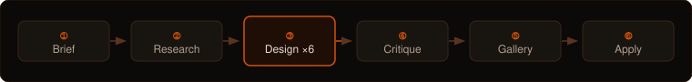

<div align="center">


<br>

One command turns a project brief into six genuinely distinct, production-ready design themes —<br>
previewed as a website, a web app, and a native mobile app — then applies the one you pick.

<br>

&nbsp;&nbsp;&nbsp;&nbsp;&nbsp;&nbsp;

</div>

---

<div align="center">

</div>

<br>

## Commands

| Command | What it does |
|---|---|
| `/theme-forge:generate-themes` | research → 6 themes → browser preview → you pick → applied |
| `/theme-forge:apply-theme <slug>` | apply a generated theme to this project |
| `/theme-forge:export-theme <slug>` | save a theme as a zip |
| `/theme-forge:refresh-design-knowledge` | force a full knowledge refresh from the live web |

Works for web projects, React Native / Expo apps, and monorepos containing both.

---

## What makes it different

### Research first, every run

Before generating anything, fourteen design-knowledge domains are refreshed from the live web — current CSS features, DTCG token standards, Expo / React Native constraints, WCAG 2.2 — and a per-domain changelog is reported. Offline, it says so and uses the seeded baseline.

```
  01-design-tokens     02-color              03-typography       04-aesthetics
  05-css-platform      06-motion             07-component-sys    08-logos-graphics
  09-mobile            10-accessibility      11-native-platform  12-asset-tooling
  13-anti-patterns     14-asset-sources
```

### Three platforms, no primary

```
  tokens.json  ── platform-neutral source of truth ──────────────────────
       │                                      │
       ▼                                      ▼
  CSS custom properties               React Native flat values
  (website · webapp)                  (Expo · React Native)
       │                                      │
       ▼                                      ▼
  surfaces/<surface>.css              theme.ts
                                           ▲
                                     tf_native.py — hard gate
                                     oklch()  clamp()  "16px"
                                     multiplier lineHeight  ✗
```

Every theme's tokens are resolved twice. `tf_native.py` is a hard gate that stops CSS-shaped values from reaching a `theme.ts` where React Native would silently ignore them.

### Bespoke, not reskinned

There are no shared page-structure templates. A `surface-composer` agent writes each theme's markup and styling from scratch — for every surface — drawing only from that theme's own tokens and creative direction.

```
  Six themes  =  six independently authored websites
                 six independently authored webapps
                 six independently authored mobile apps
```

### An honest mobile preview

The gallery renders both an iOS and an Android device frame, each showing that theme's own screens (at least four, chosen by the theme itself). Where a theme's mobile expression differs from its web form — a glass nav bar that needs `expo-blur`, a hard shadow Android can't do — the frame shows the *native* expression and says so.

### Safe to apply

Nothing is written without a file-by-file plan and your go-ahead. Every touched file is backed up first, with exact restore commands. Package managers are never run — install commands are printed for you.

---

## Quality gates

Every generated set passes automated checks before the design critic sees it. HIGH findings block gallery assembly.

```
  ┌──────────────────────────────────────────────────────────────────────┐
  │ Gate A   tf_distinct      palette hues ≥24° apart · unique labels   │
  │ Gate B   tf_slop    HIGH  scale(0) · opacity:0 rest-state on text   │
  │                     HIGH  fixed-px body type · sync XHR in JS       │
  │ Gate C   tf_contrast      WCAG AA color-contrast on all token pairs  │
  │ Gate D   tf_native        RN-safe values — no oklch, clamp, "16px"  │
  │ Gate 11  tf_distinct      required composition fields present        │
  │ Gate 20  tf_motion        motion ambition matches design language    │
  │ Gate 21  tf_distinct      each theme owns at least one unique face   │
  └──────────────────────────────────────────────────────────────────────┘
```

The design critic runs after all gates pass. Its screenshots land in `screenshots/visual review/` — counted in the gallery header so you know exactly how much of the set was reviewed.

---

## Install

**Via the GitHub marketplace source (recommended):**

```
/plugin marketplace add github:Theme-Forger/theme-forge
/plugin install theme-forge@theme-forge
```

Or add the marketplace to your `~/.claude/settings.json` permanently:

```json
{
  "extraKnownMarketplaces": [
    { "source": "github", "repo": "Theme-Forger/theme-forge" }
  ]
}
```

**Without a marketplace install (try it from a clone):**

```bash
git clone https://github.com/Theme-Forger/theme-forge.git
cd theme-forge
claude --plugin-dir plugins/theme-forge
```

Then `cd` into any project and run `/theme-forge:generate-themes`.

### Running from a clone, without a plugin install

Some environments block marketplace sources by policy. Every script call resolves its own root through a fallback chain — no edits needed:

```
"${CLAUDE_PLUGIN_ROOT:-${THEME_FORGE_ROOT:-plugins/theme-forge}}/scripts/…"
```

| Priority | Variable | Used when | Resolves to |
|---|---|---|---|
| 1 | `CLAUDE_PLUGIN_ROOT` | real plugin install — harness sets it | the install directory |
| 2 | `THEME_FORGE_ROOT` | your own layout (files copied elsewhere) | whatever you point it at |
| 3 | *(neither)* | repo clone, cwd = repo root | `plugins/theme-forge` |

From a clone, `/theme-forge:generate-themes` works with no configuration as long as cwd is the repo root. For any other layout, export `THEME_FORGE_ROOT` once:

```bash
export THEME_FORGE_ROOT=/path/to/theme-forge/plugins/theme-forge
```

An installed plugin is unaffected — `CLAUDE_PLUGIN_ROOT` wins whenever it is set. Note that `CLAUDE_PLUGIN_ROOT` is only substituted by the harness in `hooks/hooks.json`; it is *not* exported into the shell that agent and skill bodies run commands in, which is why the chain exists rather than a bare reference.

---

## A session

```
you ▸ /theme-forge:generate-themes

tf  ▸ Reading your brief… I found a CLAUDE.md.

      Product   A budgeting app for freelancers with irregular income.
      Audience  Solo freelancers, 25–45, anxious about cash flow.
      Feel      Calm, trustworthy, quietly confident.
      Platforms web + native (Expo Router, NativeWind v4)  ← primary: native

      That right? (edit anything, or say "go")

you ▸ go

tf  ▸ Refreshing design knowledge… (native platform moves fastest, checking it)
      • 05-css-platform — Tailwind 4.2 notes updated, Baseline dates refreshed
      • 07-component-systems — Base UI is now shadcn's default primitive layer
      • 11-native-platform — Expo SDK 54 config surface, Reanimated 4 spring API
      Knowledge refreshed 3 domains, seed baseline for the rest.

tf  ▸ Six directions for a calm, native-first budgeting app:

      ┌──────────────────────┐  ┌──────────────────────┐  ┌──────────────────────┐
      │ A  Quiet Professional│  │ B  Confident Saturate │  │ C  Editorial Type-Led│
      └──────────────────────┘  └──────────────────────┘  └──────────────────────┘
      ┌──────────────────────┐  ┌──────────────────────┐  ┌──────────────────────┐
      │ D  Technical Dark    │  │ E  Warm Human         │  │ F  Bento Modular  ←  │
      └──────────────────────┘  └──────────────────────┘  └──────────────────────┘

      Swap any one, or say "go".

you ▸ go

tf  ▸ Wiping the previous set and generating six themes in parallel…
      [6 theme-designer + 6 brand-asset-designer + 18 surface-composer agents]
      ✓ 01-slate-ledger  ✓ 02-amber-signal  ✓ 03-granite-press
      ✓ 04-carbon-desk   ✓ 05-clay-calm     ✓ 06-bento-books
      All gates passed. Critique: all six distinct (hues 24°+ apart).
      02 needs a dev build (expo-blur on the nav bar) — flagged.
      Gallery assembled.

      Opening → file:///…/.theme-forge/current/gallery.html

      Which one? (number, name, slug, or "the warm one")

you ▸ the warm one

tf  ▸ 05 Clay Calm — "made by people, for people." Applying to your Expo project.

      Plan:
        create  theme/theme.ts, theme/useTheme.ts, theme/global.css
        edit    app/_layout.tsx  (+ThemeProvider, +useFonts — 4 lines)
        edit    app.json         (icon / splash / adaptiveIcon / userInterfaceStyle)
        skip    node_modules, .git, lockfile
        install you'll need:  npx expo install expo-font @expo-google-fonts/fraunces

      Backup → …/current/backups/2026-08-20T05-14-02Z/. Go ahead?

you ▸ yes

tf  ▸ Done. THEME.md written. Revert with the one-liner in THEME-ROLLBACK.md.
      Want me to save this theme as a zip? (it'll land in your project root)
```

---

## Upgrading: your design knowledge does not come from the plugin

Read this once before you edit anything under `plugins/theme-forge/knowledge/`.

Theme Forge keeps its design knowledge in two places, and the one shipped in the plugin is not the one the agents read:

```
  plugins/theme-forge/knowledge/   ←  seed   shipped with the plugin; hand-authored baseline
  $TF_HOME/knowledge/              ←  live   the only copy any agent ever reads
```

Seeding is **copy-if-absent**, and it runs on every session start (`hooks/hooks.json` calls `tf_seed_knowledge.py --quiet`). On first run each domain is copied across; on every run after that the seeder finds the live file already present and skips it — deliberately, because `/theme-forge:refresh-design-knowledge` may have improved it with researched, sourced material the seed knows nothing about.

**The consequence, stated plainly: once a domain has been seeded, editing the plugin's copy of it has no effect on that install — ever.** Update the plugin, pull a new version, hand-edit a seed file: agent behaviour does not change. Nothing errors and nothing warns you. This is not a bug to be fixed but a property of the design, and every user with a populated `$TF_HOME` inherits it silently. It is normally discovered by wondering why a careful edit did nothing.

What to do instead:

- **To change agent behaviour now:** edit `$TF_HOME/knowledge/<domain>.md`. That is the live file.
- **To change it for future installs too:** make the *same* edit to the plugin seed as well. Two small edits, one per copy.
- **Never "sync" the two with a whole-file copy.** `Copy-Item`, `cp`, `robocopy`, or `tf_seed_knowledge.py --force` will replace the live file wholesale and discard every researched fact in it. This has cost a full re-research pass before. If the two copies have genuinely diverged, reconcile them paragraph by paragraph.
- **To find edits that never landed:** `python3 plugins/theme-forge/scripts/tf_knowledge_drift.py` reports seed content missing from live, and labels each gap `internal` (Theme Forge machinery a web refresh cannot regenerate — the seed is authoritative, so a gap is a real defect) or `external` (a claim about the world that a refresh may have deliberately superseded).

`$TF_HOME` resolves to `$THEME_FORGE_HOME`, else `$CLAUDE_PLUGIN_DATA`, else `~/.theme-forge`. Deleting `$TF_HOME/knowledge/` is a legitimate hard reset — the next run re-seeds from the plugin, at the cost of any refreshed research it held.

---

## License

MIT. See [LICENSE](LICENSE).
